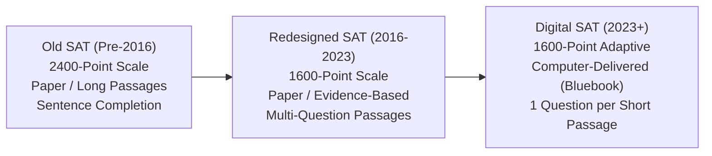
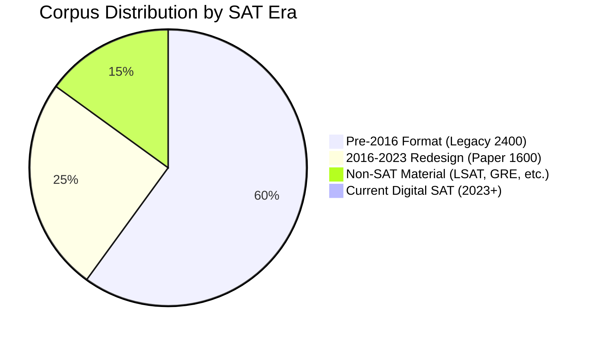
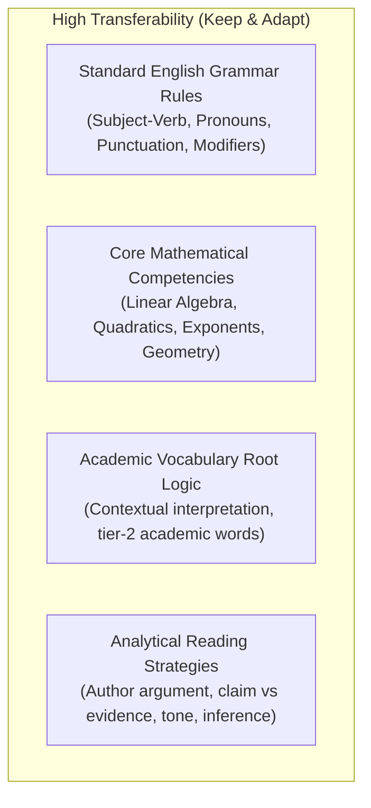
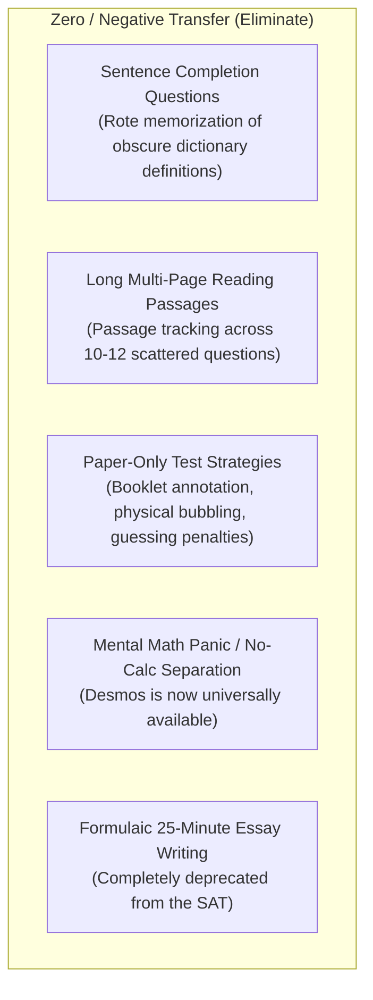

# CURRENT VS LEGACY SAT ANALYSIS
**Architectural Evolution, Corpus Era Distribution, and Pedagogical Transferability**  
*SAT Intelligent Learning System — Curriculum Design Subsystem*  
*Report Date: September 22, 2026*

---

## 1. THREE ERAS OF THE SAT EXAMINATION

To engineer a valid, contemporary learning platform from a diverse legacy corpus, one must systematically differentiate the structural, psychometric, and cognitive specifications of the three primary SAT epochs:

### Comparative Architecture Matrix

| Dimension | Old SAT (Pre-2016) | Redesigned Paper SAT (2016–2023) | Digital SAT (2023–Present) |
| :--- | :--- | :--- | :--- |
| **Delivery Medium** | Paper & pencil booklet | Paper & pencil booklet | Fully digital (Bluebook app on laptop/tablet) |
| **Test Duration** | 3 hours 45 minutes | 3 hours (3h 50m with optional essay) | **2 hours 14 minutes** (significantly shorter) |
| **Scoring Scale** | 600–2400 (CR: 800, W: 800, M: 800) | 400–1600 (RW: 800, Math: 800) | **400–1600 (RW: 800, Math: 800)** |
| **Section Architecture** | 10 separate timed sections (variable order) | 4 distinct sections (Reading, Writing, Math No-Calc, Math Calc) | **2 Sections, each with 2 timed Modules (4 modules total)** |
| **Adaptivity** | Linear (fixed form for all test-takers) | Linear (fixed form for all test-takers) | **Multistage Adaptive Testing (MST)** at module level |
| **Reading Format** | Long passages (500–850 words) + short passages; 5–12 questions per passage | Long passages (500–750 words); 10–11 questions per passage; paired passages | **Short passages (25–150 words); strictly 1 question per passage** |
| **RW Question Types** | Sentence completions (isolated obscure vocabulary); critical reading | Passage-based reading; passage-based writing/editing in context | Words in context, central idea, textual/quantitative evidence, inferences, transitions, rhetorical synthesis, grammar |
| **Mathematics Structure** | No-calculator / calculator mixed in sections; penalty for wrong answers | Section 3 (No-Calc, 25m) + Section 4 (Calc, 55m); 58 questions total | **Calculator allowed on ENTIRE section; built-in Desmos graphing calculator; 44 questions total** |
| **Math Question Format** | Multiple-choice + Grid-in (10 items) | Multiple-choice + Grid-in (13 items) | Multiple-choice + Student-Produced Response (SPR, ~25%) |
| **Guessing Penalty** | -0.25 point deduction per incorrect answer | No penalty (rights-only scoring) | No penalty (rights-only scoring) |
| **Essay Requirement** | Mandatory 25-minute persuasive essay | Optional 50-minute rhetorical analysis essay | **Completely eliminated** |

---

## 2. CORPUS ERA DISTRIBUTION

An analytical audit of the local repository reveals a significant temporal mismatch between available materials and contemporary test requirements:

* **Pre-2016 Format (~60% of corpus)**:
  * Dominated by legacy prep materials from 2004–2015 (e.g., *Master the SAT 2008/2015*, *McGraw-Hill SAT 2011*, *Acing the SAT 2006*, *Direct Hits 2011*, *Defining Twilight/Eclipse*).
  * Characteristics: High emphasis on isolated dictionary vocabulary flashcards, sentence completion sentence drills, long multi-column reading passages, and penalty-avoidance test strategy.
* **2016 Redesign Format (~25% of corpus)**:
  * Key contemporary sources from 2016–2018 (e.g., *Kaplan SAT 2018*, *Barron's New SAT 2016*, *McGraw-Hill Education SAT 2016*, *1,500 Practice Questions*, *Math Workout for the SAT 2016*).
  * Characteristics: Evidence-based reading, contextual grammar, contemporary math domain distribution (Algebra, Advanced Math, PSDA).
* **Non-SAT Material (~15% of corpus)**:
  * Includes 87 LSAT test and explanation files, TOEFL exam success guides, GRE vocabulary manuals, GED preparation books, and SAT Subject Test (Math 2, Literature, World History) manuals.
* **Digital SAT 2023+ (0% of corpus)**:
  * Zero native Digital SAT practice modules or Bluebook item bank exports were present in the source files.

---

## 3. PEDAGOGICAL TRANSFERABILITY ANALYSIS

Building a functional modern system requires discerning what knowledge remains evergreen versus what content is obsolete or counterproductive.

### 3.1 What TRANSFERS Directly from Legacy Material

1. **Standard English Conventions (Grammar & Syntax)**:
   * Punctuation mechanics (semicolons, colons, dashes, apostrophes, comma splices) are invariant across all SAT versions.
   * Subject-verb agreement, pronoun-antecedent agreement, dangling modifiers, verb tense sequence, and parallel structure carry 100% transferability into the Digital SAT *Boundaries* and *Form, Structure, and Sense* question types.
2. **Core Mathematics Foundations**:
   * Fundamental algebra (linear equations, systems of equations, inequalities), advanced algebra (polynomial arithmetic, quadratic functions, rational expressions), and coordinate geometry remain central.
   * Geometric formulas for volume, circle theorems, and right-triangle trigonometry definitions remain identical.
3. **Reading Comprehension & Critical Analysis**:
   * Core reading skills—identifying the thesis, determining the author's primary purpose, spotting counterarguments, and evaluating supporting claims—remain valid despite the shift from long passages to micro-passages.
4. **Vocabulary in Nuanced Context**:
   * While memorizing arcane "SAT words" like *antidisestablishmentarianism* is obsolete, understanding high-utility tier-2 academic vocabulary (*mitigate*, *corroborate*, *ubiquitous*, *anomalous*) directly benefits the modern *Words in Context* question type.

---

### 3.2 What DOES NOT Transfer (Counterproductive / Obsolete)

1. **Sentence Completion Drills**:
   * Pre-2016 tests used isolated sentences with one or two blanks requiring esoteric vocabulary knowledge. In Digital SAT, vocabulary is tested exclusively within rich, naturalistic paragraphs.
2. **Long Passage Navigation Tactics**:
   * Legacy strategies emphasized passage skimming, line-number indexing, and parallel question tracking. On the Digital SAT, every passage is 25–150 words long and serves **exactly one question**, rendering global skimming strategies ineffective.
3. **No-Calculator Computational Tricks**:
   * Prior to 2023, students faced a mandatory No-Calculator section testing pen-and-paper mental computation speed. On the Digital SAT, Desmos is built into every math question. Modern test strategy focuses on *calculator efficiency* (knowing when to leverage Desmos versus when to solve symbolically).
4. **Guessing Penalty Calculus**:
   * Pre-2016 SAT penalized wrong answers (-0.25 pt). Contemporary SAT uses rights-only scoring; omitting a question is never optimal.
5. **Paper Booklet Annotations**:
   * Physical bubbling, booklet page-flipping, and margin pencil tracking are superseded by on-screen line annotations, answer elimination buttons, and the question review flag within the Bluebook interface.

---

## 4. SYSTEM ADAPTATION STRATEGY

To overcome the lack of native Digital SAT assets, the platform enforces three architectural adaptations:
1. **Micro-Passage Generation**: Deconstructing legacy long passages and synthesizing new, original 50–120 word single-prompt passages matching official College Board domain specifications.
2. **Desmos Integration Paradigm**: Training students on the standard dual-track mathematical framework (`GIVEN-TARGET-MODEL-SOLVE-VERIFY`) combined with explicit Desmos decision trees.
3. **Cognitive Error Profiling**: Replacing legacy score approximation with 17-type granular error diagnostics, directly aligning learning feedback to digital testing realities.
