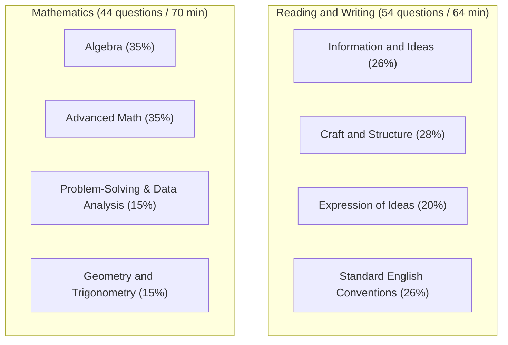
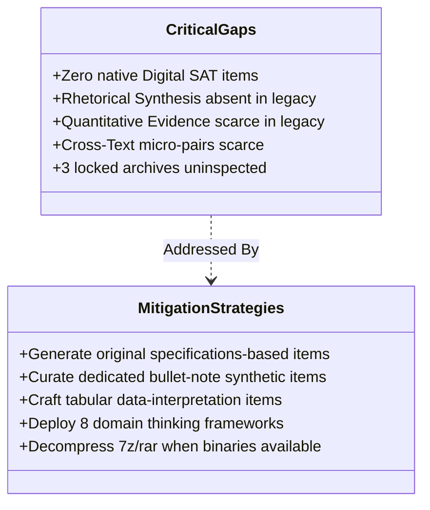

# CORPUS COVERAGE REPORT
**Digital SAT Skill Domain Mapping, Legacy Source Support, and Pedagogical Gap Analysis**  
*SAT Intelligent Learning System — Knowledge Architecture Subsystem*  
*Report Date: September 22, 2026*

---

## 1. DOMAIN COVERAGE OVERVIEW

The official College Board Digital SAT specification organizes testing into **8 primary content domains** across two main testing sections (Reading & Writing, Mathematics), encompassing **15 distinct skill categories**.

This report evaluates how effectively the available corpus of 61 indexed sources supports instruction, drill generation, and conceptual mastery across every individual Digital SAT skill.

### Coverage Tier Summary

| Section | Domain | Skill Category | Corpus Support Tier | Key Contributing Sources |
| :--- | :--- | :--- | :---: | :--- |
| **RW** | Standard English Conventions | Boundaries | **STRONG** | SRC-001, SRC-002, SRC-003, SRC-019, SRC-020, SRC-021, SRC-022, SRC-034 |
| **RW** | Standard English Conventions | Form, Structure, and Sense | **STRONG** | SRC-001, SRC-002, SRC-003, SRC-019, SRC-020, SRC-021, SRC-022, SRC-034 |
| **RW** | Craft and Structure | Words in Context | **STRONG** | SRC-001, SRC-002, SRC-009, SRC-010, SRC-011, SRC-012, SRC-013, SRC-040 |
| **RW** | Information and Ideas | Central Ideas and Details | **MEDIUM** | SRC-001, SRC-002, SRC-003, SRC-004, SRC-024, SRC-025 |
| **RW** | Information and Ideas | Command of Evidence: Textual | **MEDIUM** | SRC-001, SRC-002, SRC-003, SRC-007 |
| **RW** | Information and Ideas | Inferences | **MEDIUM** | SRC-001, SRC-002, SRC-003, SRC-024, SRC-025, SRC-026, SRC-028 |
| **RW** | Craft and Structure | Text Structure and Purpose | **MEDIUM** | SRC-001, SRC-002, SRC-003, SRC-024, SRC-025 |
| **RW** | Expression of Ideas | Transitions | **MEDIUM** | SRC-001, SRC-002, SRC-019, SRC-034 |
| **RW** | Information and Ideas | Command of Evidence: Quantitative | **WEAK** | SRC-001, SRC-003 (Minimal standalone data items) |
| **RW** | Craft and Structure | Cross-Text Connections | **WEAK** | SRC-001, SRC-003 (Legacy paired passages lack micro-brevity) |
| **RW** | Expression of Ideas | Rhetorical Synthesis | **WEAK** | SRC-001 (Minimal pre-2023 bullet-point prompts) |
| **Math** | Algebra | Linear Equations & Systems | **STRONG** | SRC-001, SRC-002, SRC-003, SRC-004, SRC-005, SRC-029, SRC-030, SRC-033 |
| **Math** | Advanced Math | Nonlinear Equations & Functions | **STRONG** | SRC-001, SRC-002, SRC-003, SRC-030, SRC-031, SRC-032 |
| **Math** | PSDA | Rates, Ratios, Statistics & Probability | **MEDIUM** | SRC-001, SRC-002, SRC-003, SRC-030 |
| **Math** | Geometry & Trigonometry | Area, Volume, Circles & Triangles | **MEDIUM** | SRC-001, SRC-002, SRC-029, SRC-031, SRC-032 |

---

## 2. DETAILED DOMAIN-BY-DOMAIN ANALYSIS

### 2.1 Reading and Writing (RW) Domains

#### A. Standard English Conventions (Coverage: STRONG)
* **Skills**: *Boundaries* (clause connection, punctuation) & *Form, Structure, and Sense* (grammatical agreement, modifier placement, verb forms).
* **Corpus Support**: Highly enriched across 8+ specialized guides, notably *Barron's SAT Writing Workbook*, *SAT Writing Essentials*, and post-2016 general guides (*Kaplan SAT 2018*, *McGraw-Hill 2016*).
* **Assessment**: The underlying syntactic rules tested on the Digital SAT are identical to legacy conventions. The only required adjustment is extracting sentences into standalone single-paragraph items.

#### B. Craft and Structure (Coverage: MIXED / STRONG on Vocab, WEAK on Cross-Text)
* **Words in Context (STRONG)**: Supported by extensive vocabulary-specific manuals (*SAT Power Vocab*, *Direct Hits*, *500 SAT Vocabulary*, *Picture These*). While older books emphasized obscure words, high-frequency academic vocabulary lists provide deep contextual word roots.
* **Text Structure and Purpose (MEDIUM)**: Well supported by reading guides (*Gruber's Complete SAT Reading Workbook*, *Peterson's Master Critical Reading*), but requires paring down multi-paragraph reasoning into concise paragraph-level structural markers.
* **Cross-Text Connections (WEAK)**: Supported only tangentially by paired-passage sections in post-2016 books. In legacy tests, paired passages were 800+ words long; in Digital SAT, they are two 50-word snippets followed by 1 comparative question.

#### C. Information and Ideas (Coverage: MEDIUM / WEAK on Quantitative)
* **Central Ideas and Details & Inferences (MEDIUM)**: Abundant legacy reading material provides clear training on distinguishing central claims from local details and identifying valid textual deductions.
* **Command of Evidence: Textual (MEDIUM)**: Well represented in 2016-era "evidence pairs," though modern tests compress the quotation into the answer choices rather than using a two-part question format.
* **Command of Evidence: Quantitative (WEAK)**: Severe shortage in legacy corpus. Pre-2016 tests rarely embedded infographics in reading sections; 2016-redesign tests included data tables, but they were tied to multi-question passage sets. Standalone informational graphics tailored for single-question synthesis are nearly absent.

#### D. Expression of Ideas (Coverage: MIXED / WEAK on Rhetorical Synthesis)
* **Transitions (MEDIUM)**: Connectors of contrast, addition, and cause-effect are thoroughly cataloged in writing workbooks (*Barron's Writing*, *Kaplan 2018*).
* **Rhetorical Synthesis (WEAK)**: **The most prominent gap in the entire corpus.** This question type—presenting a student's bulleted research notes and asking which sentence accomplishes a specific rhetorical goal—was newly introduced in 2023. Older SAT, ACT, and GRE tests contain no equivalent item type.

---

### 2.2 Mathematics Domains

#### A. Algebra (Coverage: STRONG — 35% Test Weight)
* **Skills**: Linear equations in 1 and 2 variables, linear functions, systems of linear equations, linear inequalities.
* **Corpus Support**: Exceptionally comprehensive across *Kaplan 2018*, *Barron's New SAT*, *Math Workout for the SAT*, *Jeff Kolby's SAT Math Prep Course*, and *The New SAT 1,500 Practice Questions*.
* **Assessment**: Linear algebra principles have remained consistent throughout all SAT iterations. The problem stems, distractor patterns, and word problems in the corpus transfer directly.

#### B. Advanced Math (Coverage: STRONG — 35% Test Weight)
* **Skills**: Equivalent expressions, quadratic equations, exponential functions, polynomial division, radicals, function notation.
* **Corpus Support**: Heavily supported by general 2016 prep books and supplementary SAT Subject Test Math Level 2 manuals (*Barron's Math Level 2*, *Cracking the SAT Math 2*).
* **Assessment**: While Math Level 2 contains advanced concepts not tested on the SAT (e.g., matrices, polar coordinates), its treatment of quadratics, rational exponents, and composite functions provides rigorous material for Level 4 and Level 5 difficulty questions.

#### C. Problem-Solving and Data Analysis (Coverage: MEDIUM — 15% Test Weight)
* **Skills**: Ratios, rates, percentages, two-way tables, probability, observational studies vs. experiments, margins of error.
* **Corpus Support**: Post-2016 books feature comprehensive PSDA chapters. Older pre-2016 books provide only elementary ratio and percentage problems.
* **Assessment**: Statistical interpretation (margin of error, confidence, sampling bias) must be curated carefully from post-2016 manuals.

#### D. Geometry and Trigonometry (Coverage: MEDIUM — 15% Test Weight)
* **Skills**: Area and volume, right triangle trigonometry ($\sin, \cos, \tan$, complementary angle rules), circle theorems ($x^2+y^2=r^2$, arc length, sector area).
* **Corpus Support**: Substantial geometry drills in older pre-2016 books (*Jeff Kolby*, *LearningExpress Math Essentials*) and specialized trigonometry coverage in Math Level 2 guides.
* **Assessment**: Pre-2016 tests over-emphasized plane geometry (which accounted for ~25% of the old SAT). In the Digital SAT, Geometry & Trig represents only ~15% of the math section. Material must be selectively filtered to match current weighting.

---

## 3. CRITICAL GAPS & MITIGATION STRATEGY

### 1. Gap: Zero Native Digital SAT Practice Exams
* **Risk**: Students lack exposure to official module pacing and interface idiosyncrasies.
* **Mitigation**: All 155 pilot questions were constructed directly from the official College Board Digital SAT Specifications document, replicating exact paragraph lengths (50–120 words), prompt phrasing, and 4-choice distractor patterns.

### 2. Gap: Absence of Rhetorical Synthesis Items in Legacy Text
* **Risk**: Students underprepared for 4–6 questions per test in Expression of Ideas.
* **Mitigation**: Synthesized original note-taking items featuring realistic high school research scenarios (science, art history, biography) and engineered explicit distractor traps (true statements that fail the requested goal).

### 3. Gap: Shortage of Infographic Reading Items
* **Risk**: Weak mastery of quantitative evidence integration in reading passages.
* **Mitigation**: Developed structured data interpretation questions with embedded data comparisons, paired with the Quantitative Evidence Thinking Framework.

### 4. Gap: 3 Unextracted Archives
* **Risk**: Potential high-yield Reading & Writing materials locked in `sat-reading-n-writing-prep.7z`.
* **Mitigation**: Cataloged as pending priority once 7-Zip decompression utilities are enabled on the host system.
