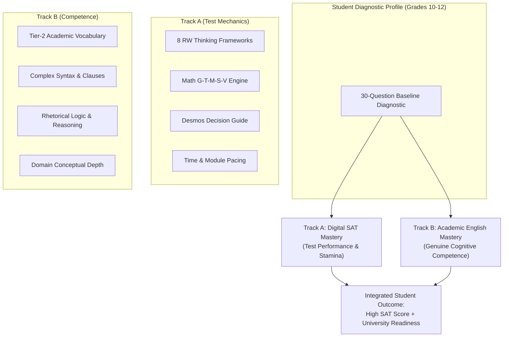
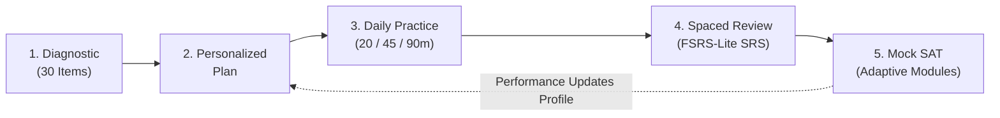
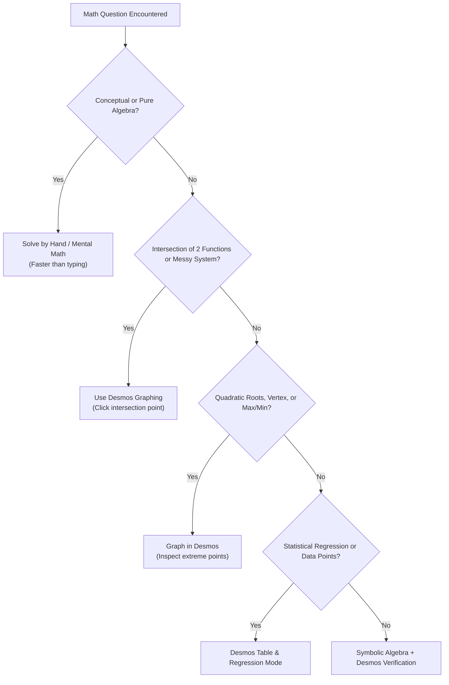

# CURRICULUM ARCHITECTURE
**Pedagogical Blueprint, Dual-Track Learning Model, and Cognitive Error Diagnostics**  
*SAT Intelligent Learning System — Instructional Design Subsystem*  
*Report Date: September 22, 2026*

---

## 1. DUAL-TRACK PEDAGOGICAL PHILOSOPHY

The curriculum is structured around a core pedagogical insight: high school students in Vietnam (ages 15–18) facing the Digital SAT need both immediate **test performance techniques** and long-term **academic language competence**. Addressing only test tricks leads to score plateaus, while teaching generic English without test-specific calibration produces slow test performance.

### Track Comparison

| Dimension | Track A: Digital SAT Mastery | Track B: Academic English Mastery |
| :--- | :--- | :--- |
| **Primary Objective** | Maximize scaled score (400–1600) on the official Digital SAT | Develop authentic reading comprehension, analytical writing, and academic reasoning |
| **Target Mechanism** | Pattern recognition, distractor elimination, timing efficiency, Desmos shortcuts | Morphological root analysis, syntactic parsing, semantic nuance, argumentative logic |
| **Target Audience** | Students within 3–6 months of official test date; Grade 11–12 intensive prep | Students starting in Grade 10 or early Grade 11; Foundation English learners |
| **Pacing & Cadence** | Timed drills, module simulation, error triage | Deep reading, vocabulary flashcards (SRS), grammar rule foundations |

---

## 2. THE FIVE-STAGE LEARNING PROGRESSION

Every student follows a structured, closed-loop learning cycle:

1. **Stage 1: Baseline Diagnostic (30 Items)**
   * Balanced diagnostic: 15 RW questions and 15 Math questions spanning all 8 domains.
   * Generates an initial skill profile identifying baseline accuracy across all 15 skills.
2. **Stage 2: Dynamic Personalized Plan**
   * Pacing calibrated by high school grade (Grade 10: foundational long-term pace; Grade 11: steady comprehensive pace; Grade 12: high-intensity sprint).
   * Prioritizes the student's 3 lowest-accuracy skills with high test weight (e.g., Algebra and Boundaries prioritized over rare subtopics).
3. **Stage 3: Daily Practice Sessions**
   * Configurable session lengths to match real-world student availability:
     * **20 Minutes (Sprint)**: Quick 10–12 question drill targeting 1 weak skill + 5 flashcards.
     * **45 Minutes (Standard)**: 25 questions across 2 domains + error diagnosis review.
     * **90 Minutes (Deep Dive)**: Full module simulation + complete reflection + flashcard deck review.
4. **Stage 4: Spaced Review (Adaptive SRS)**
   * Utilizes a modified FSRS-lite (Free Spaced Repetition Scheduler) algorithm for flashcards and previously missed test questions.
   * Cards and concepts are scheduled at expanding intervals (1 day $\rightarrow$ 3 days $\rightarrow$ 7 days $\rightarrow$ 21 days $\rightarrow$ 60 days) based on student rating (`Again`, `Hard`, `Good`, `Easy`).
5. **Stage 5: Verification via Mock Tests**
   * Timed module practice testing sustained cognitive focus across 64 minutes (RW) and 70 minutes (Math).

---

## 3. DIFFICULTY TAXONOMY (5-LEVEL SYSTEM)

Questions and instructional modules are calibrated across a 5-tier difficulty continuum:

| Level | Classification | Cognitive Demand | Target Audience | Example Characteristic |
| :---: | :--- | :--- | :--- | :--- |
| **1** | **Foundation** | Recall & direct recognition; single-step calculation; isolated grammar rules | Foundation learners; starting baseline | Direct subject-verb agreement; simple linear equation $ax+b=c$ |
| **2** | **Core** | Standard application; 2-step solution; basic context interpretation | Grade 10 standard; core SAT baseline | Linear systems by substitution; standard transition words (*however*, *therefore*) |
| **3** | **Applied** | Multi-step reasoning; subtle distractors; compound sentences; basic charts | Average SAT target (1000–1200 range) | Evidence choice with one tempting close distractor; quadratic factoring with leading coefficient |
| **4** | **Advanced SAT** | Abstract synthesis; dense academic vocabulary; complex infographic cross-referencing | Competitive college applicants (1300–1450 range) | Rhetorical synthesis with competing constraints; circle equation completing the square |
| **5** | **Transfer** | Novel context; extreme nuance; multi-variable constraints; non-obvious Desmos model | Top percentile applicants (1500–1600 range) | Double-negative inference passages; non-linear systems with parameter constants ($k$) |

---

## 4. THINKING FRAMEWORKS & DECISION ENGINES

### 4.1 The 8 Reading & Writing Thinking Frameworks

The platform provides explicit algorithmic problem-solving steps for each of the 8 RW skills (defined in [rw_frameworks.json](file:///d:/antigravity_scratch/real_estate_scoring/sql/SAT/data/frameworks/rw_frameworks.json)):

1. **Words in Context**:
   * *Steps*: 1. Cover choices $\rightarrow$ 2. Read sentence & deduce tone/role $\rightarrow$ 3. Predict own simple replacement word $\rightarrow$ 4. Match prediction to choices $\rightarrow$ 5. Reject dictionary traps.
   * *Key Insight*: SAT tests contextual fitness, not dictionary definitions.
2. **Inferences**:
   * *Steps*: 1. Extract explicit facts $\rightarrow$ 2. Identify minimal necessary conclusion ($P \Rightarrow Q$) $\rightarrow$ 3. Reject external assumptions $\rightarrow$ 4. Select the most conservative choice.
   * *Key Insight*: The correct inference requires the smallest cognitive leap from the text.
3. **Command of Evidence: Textual**:
   * *Steps*: 1. Pinpoint the exact claim $\rightarrow$ 2. Scan for directly supporting evidence $\rightarrow$ 3. Discard choices that are merely thematic or topical.
   * *Key Insight*: Topical relevance $\neq$ evidentiary support.
4. **Command of Evidence: Quantitative**:
   * *Steps*: 1. Identify specific claim $\rightarrow$ 2. Verify axes, legends, units, and categories $\rightarrow$ 3. Establish mathematical trend $\rightarrow$ 4. Confirm data direction matches claim.
   * *Key Insight*: Claims of "majority" or "highest" require verifying all data rows, not just two.
5. **Cross-Text Connections**:
   * *Steps*: 1. Summarize Text 1 position in $\le 5$ words $\rightarrow$ 2. Summarize Text 2 position in $\le 5$ words $\rightarrow$ 3. Determine relationship (agrees, refutes, qualifies) $\rightarrow$ 4. Match relationship.
   * *Key Insight*: Focus on how authors interact, not just what topics they mention.
6. **Transitions**:
   * *Steps*: 1. Blank out current transition $\rightarrow$ 2. Read preceding sentence $\rightarrow$ 3. Read subsequent sentence $\rightarrow$ 4. Classify relation (Contrast, Cause-Effect, Addition, Sequence) $\rightarrow$ 5. Pick matching category.
   * *Key Insight*: The relationship between ideas dictates the word, never vice versa.
7. **Rhetorical Synthesis**:
   * *Steps*: 1. Read the stated goal first $\rightarrow$ 2. Identify relevant notes that fulfill that goal $\rightarrow$ 3. Eliminate grammatically correct choices containing irrelevant notes $\rightarrow$ 4. Select most concise fulfilling sentence.
   * *Key Insight*: Factually true $\neq$ rhetorically relevant.
8. **Standard English Conventions**:
   * *Steps*: 1. Identify independent clauses and boundary markers $\rightarrow$ 2. Verify subject-verb agreement and modifier proximity $\rightarrow$ 3. Choose punctuation (period/semicolon vs. comma vs. colon) $\rightarrow$ 4. Verify clarity.
   * *Key Insight*: Two independent clauses cannot be joined by a comma alone (comma splice).

### 4.2 The Math 5-Step Framework: GIVEN-TARGET-MODEL-SOLVE-VERIFY

Every mathematical solution in the system follows a standardized 5-step cognitive template:
* **G (GIVEN)**: What data, equations, constants, and geometric constraints are stated?
* **T (TARGET)**: What exact quantity is requested? (e.g., $x$, $2x-5$, slope, vertex $y$-coordinate).
* **M (MODEL)**: What mathematical relationship connects GIVEN to TARGET?
* **S (SOLVE)**: Execute the most efficient method (algebraic manipulation or Desmos entry).
* **V (VERIFY)**: Check units, sign, domain restrictions, and answer plausibility.

### 4.3 The Calculator & Desmos Decision Guide

---

## 5. COGNITIVE ERROR TAXONOMY (17 ERROR TYPES)

To replace uninformative percentage scores with actionable diagnostic feedback, the platform implements a 17-part cognitive error classification system:

| # | Error Code | Category | Description & Student Remediation |
| :---: | :--- | :---: | :--- |
| **1** | `VOCAB_DICTIONARY_TRAP` | RW | Selected literal dictionary definition that fails in the specific contextual nuance |
| **2** | `EXTREME_LANGUAGE_TRAP` | RW | Fell for choices with unwarranted absolute qualifiers (*always*, *never*, *completely*) |
| **3** | `HALF_RIGHT_HALF_WRONG` | RW | Choice begins accurately but appends an unsupported or contradictory claim |
| **4** | `OUT_OF_SCOPE_IRRELEVANT` | RW | Selected choice containing true external facts not mentioned in the passage |
| **5** | `OPPOSITE_DIRECTION` | RW | Reversed the author's logic, causal relationship, or argumentative stance |
| **6** | `WRONG_REFERENCE_ATTRIBUTION` | RW | Misattributed a quote, claim, or viewpoint to the wrong speaker or text |
| **7** | `OVER_INFERENCE_SPECULATION` | RW | Made an unjustified logical leap beyond the explicit boundaries of the text |
| **8** | `PUNCTUATION_SPLICE_RUNON` | RW | Failed to recognize comma splices, fused sentences, or fragment boundaries |
| **9** | `GRAMMAR_AGREEMENT_CLASH` | RW | Overlooked subject-verb, pronoun-antecedent, or modifier agreement errors |
| **10** | `RHETORICAL_GOAL_MISALIGN` | RW | Selected a true summary of notes that failed to achieve the specific prompt goal |
| **11** | `QUESTION_STEM_MISREAD` | Math | Solved for $x$ when prompt asked for $3x-2$, or confused perimeter with area |
| **12** | `SIGN_CALCULATION_SLIP` | Math | Dropped a negative sign or made a mental arithmetic error during computation |
| **13** | `FORMULA_CONCEPT_MISAPPLIED` | Math | Used wrong formula (e.g., circumference instead of area, inverted slope $\Delta x / \Delta y$) |
| **14** | `UNIT_SCALE_CONVERSION_ERROR`| Math | Neglected unit changes (minutes to hours, meters to kilometers, graph axis scales) |
| **15** | `ALGEBRAIC_MANIPULATION_TRAP`| Math | Illegal algebraic operation (e.g., $\sqrt{a^2+b^2}=a+b$, dividing by zero variable) |
| **16** | `EXTRANEOUS_SOLUTION_DOMAIN` | Math | Included extraneous roots or violated domain restrictions ($x > 0$, denominator $\neq 0$) |
| **17** | `DESMOS_INPUT_SYNTAX_ERROR` | Math | Misplaced parentheses in Desmos exponent, misread scale, or typed faulty regression syntax |

---

## 6. END-OF-SESSION REFLECTION & PROGRESS TRACKING

* **Post-Session Reflection Prompt**: After each practice batch, students complete a 3-question structured reflection:
  1. *Which question took you the longest time, and why?*
  2. *Which error was caused by knowledge gap vs. careless execution?*
  3. *What specific rule or framework step will you apply next time?*
* **Skill-Based Progress vs. Vanity Scores**: The platform deliberately avoids publishing speculative 1600-scale scores during daily practice. Instead, progress is tracked purely via **Skill Mastery Indices** (Foundation $\rightarrow$ Developing $\rightarrow$ Strong) based on rolling 10-item difficulty-weighted accuracy.
