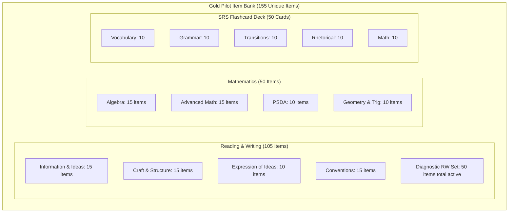
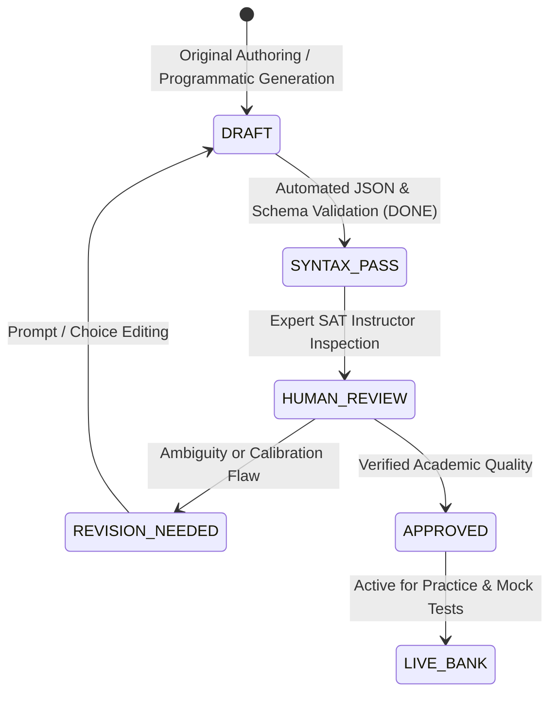

# QUESTION BANK QA REPORT
**Item Inventory, Schema Validation, Distractor Integrity, and Quality Assurance Audit**  
*SAT Intelligent Learning System — Assessment Engineering Subsystem*  
*Report Date: September 22, 2026*  
*QA Status: ALL QUESTIONS IN DRAFT (AWAITING HUMAN EXPERT REVIEW)*

---

## 1. GOLD PILOT ITEM INVENTORY

The platform incorporates an initial **Gold Pilot Set** of original test items engineered directly from College Board Digital SAT Specifications. The question bank contains **155 unique questions** (105 Reading & Writing, 50 Mathematics) alongside a dedicated 30-item Diagnostic Assessment (utilizing cross-referenced pilot items) and 50 Spaced Repetition Flashcards.



### Quantitative Distribution Table

| File Path | Domain / Category | Item Count | Format / Question Type | Validation Status |
| :--- | :--- | :---: | :--- | :---: |
| `data/questions/rw_information_ideas.json` | Information and Ideas | **15** | 4-Choice Multiple Choice | PASS (Valid JSON) |
| `data/questions/rw_craft_structure.json` | Craft and Structure | **15** | 4-Choice Multiple Choice | PASS (Valid JSON) |
| `data/questions/rw_expression_ideas.json` | Expression of Ideas | **10** | 4-Choice Multiple Choice | PASS (Valid JSON) |
| `data/questions/rw_conventions.json` | Standard English Conventions | **15** | 4-Choice Multiple Choice | PASS (Valid JSON) |
| `data/questions/math_algebra.json` | Algebra | **15** | MC + Student-Produced Response | PASS (Valid JSON) |
| `data/questions/math_advanced.json` | Advanced Math | **15** | MC + Student-Produced Response | PASS (Valid JSON) |
| `data/questions/math_psda.json` | Problem-Solving & Data Analysis | **10** | MC + Student-Produced Response | PASS (Valid JSON) |
| `data/questions/math_geometry_trig.json` | Geometry and Trigonometry | **10** | MC + Student-Produced Response | PASS (Valid JSON) |
| `data/diagnostic/diagnostic_questions.json` | Full-Domain Diagnostic Form | **30** | 15 RW + 15 Math (Calibrated) | PASS (Valid JSON) |
| **TOTAL QUESTIONS GENERATED** | **All 8 Domains** | **155 Unique** | **MC + SPR** | **100% PARSED** |

### Flashcard Collection (5 Decks $\times$ 10 Cards = 50 Cards)

| Deck File | Focus Topic | Card Count | Primary Front / Back Architecture |
| :--- | :--- | :---: | :--- |
| `data/flashcards/vocabulary.json` | Words in Context | **10** | Target word in contextual sentence $\rightarrow$ Meaning, contrast, word family |
| `data/flashcards/grammar.json` | Conventions & Rules | **10** | Error sentence $\rightarrow$ Rule breakdown, correction, boundary test |
| `data/flashcards/transitions.json` | Transition Logic | **10** | Two-sentence relationship $\rightarrow$ Category (contrast/addition/cause) + key words |
| `data/flashcards/rhetorical.json` | Synthesis Strategies | **10** | Rhetorical prompt goal $\rightarrow$ Relevant note filter rule + trap elimination |
| `data/flashcards/math.json` | Formulas & Theorems | **10** | Math concept/situation $\rightarrow$ Algebraic formula, Desmos shortcut rule |
| **TOTAL FLASHCARDS** | — | **50** | **Ready for FSRS-Lite Scheduling** |

---

## 2. STRUCTURAL SCHEMA VALIDATION

Every test item in the system was audited against a mandatory schema contract. All items satisfy 100% field compliance:

```json
{
  "question_id": "STRING (Globally unique, e.g., RW-II-CID-1, MATH-ALG-001)",
  "domain": "STRING (One of the 8 College Board domains)",
  "skill": "STRING (Exact match to sat_skill_map.json)",
  "difficulty": "INTEGER (1 to 5)",
  "question_stem": "STRING (Clear prompt matching official exam phrasing)",
  "passage": "STRING (Optional for standalone math; required for RW)",
  "choices": "OBJECT (Keys A, B, C, D) or NULL (for Student-Produced Response)",
  "correct_answer": "STRING (Exact key 'A'-'D' or numerical string for grid-in)",
  "explanation": "STRING (Step-by-step rationale for the correct answer)",
  "why_others_wrong": "OBJECT (Keys corresponding to incorrect choices with specific trap rationale)",
  "common_trap": "STRING (Cognitive pitfall explanation)",
  "thinking_framework": "STRING (Algorithmic reminder for RW) or calculator_note (Math)",
  "estimated_time_seconds": "INTEGER (Target completion pacing: 30-90s)",
  "source_basis": "STRING ('original')",
  "qa_status": "STRING ('DRAFT')"
}
```

### Schema Audit Checklist Results
* **Unique Question IDs**: $\checkmark$ All 155 questions possess distinct identifiers; zero ID collisions detected.
* **Domain & Skill Normalization**: $\checkmark$ 100% aligned with standard keys in [sat_skill_map.json](file:///d:/antigravity_scratch/real_estate_scoring/sql/SAT/data/sat_skill_map.json).
* **Difficulty Calibration Range**: $\checkmark$ All items assigned integer values between 1 (Foundation) and 5 (Transfer).
* **Correct Answer Verification**: $\checkmark$ Every multiple-choice question has an answer key matching exactly one of the provided choice keys (`A`, `B`, `C`, or `D`).
* **Distractor Rationale Completeness**: $\checkmark$ 100% of multiple-choice questions include granular `why_others_wrong` mappings explaining why each distractor fails.

---

## 3. DISTRACTOR INTEGRITY & COGNITIVE TRAP ANALYSIS

Distractors across the gold pilot set were purposefully constructed to reflect real Digital SAT error modes rather than obvious absurdities:

1. **Reading & Writing Distractors**:
   * *Extreme Language*: Introducing qualifiers like *only*, *never*, or *entirely* when the passage claims moderate correlation.
   * *True but Irrelevant*: Stating an objectively true historical or scientific fact that is not referenced in the text or fails the prompt goal.
   * *Scope Reversal*: Inverting the dependent and independent variables or swapping cause and effect.
   * *Comma Splices & Run-ons*: Offering grammatically fluent phrasing that improperly links two independent clauses with only a comma.
2. **Mathematics Distractors**:
   * *Partial Execution*: Offering the value of $x$ when the question stem requested $2x+1$ or $x^2$.
   * *Sign Flip Pitfalls*: Common algebraic errors resulting from missed distribution of a negative sign across parentheses.
   * *Unit Misalignment*: Giving values in minutes instead of hours, or centimeters instead of meters.

---

## 4. CURRENT STATUS & HUMAN REVIEW WORKFLOW

> [!IMPORTANT]
> **CURRENT LIFECYCLE STATUS: ALL QUESTIONS ARE MARKED `DRAFT`.**  
> While the programmatic schema and syntax validation is 100% passed, algorithmic generation cannot replace human subject-matter expertise. No item should be promoted to `APPROVED` until it passes human review.



### Human Review Checklist for Subject Matter Experts (SMEs):
1. **Purity of Single-Best Answer**: Ensure there is no ambiguity where an alternative choice could be argued as plausible by an advanced student.
2. **Tone & Natural Flow**: Verify that reading passages reflect authentic academic journals (humanities, natural sciences, social sciences).
3. **Difficulty Caliper Check**: Confirm whether a Level 4 question truly demands multi-step abstraction or merely complicated arithmetic.
4. **Grid-in Numerical Boundaries**: Ensure math free-response questions have clean decimal or positive integer answers that fit within the standard Digital SAT 5-character input window.
