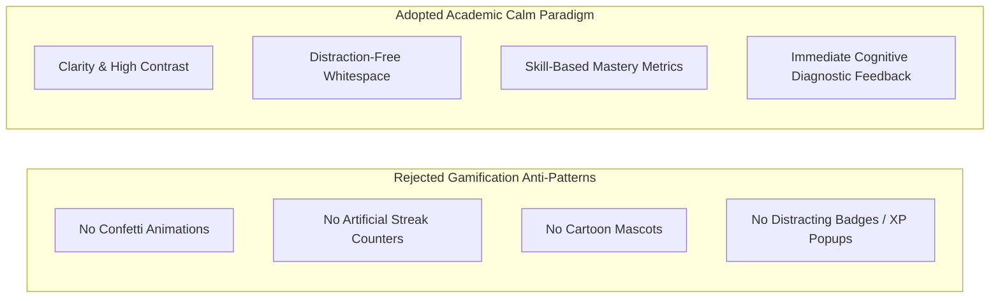
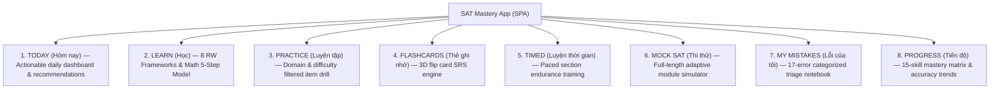
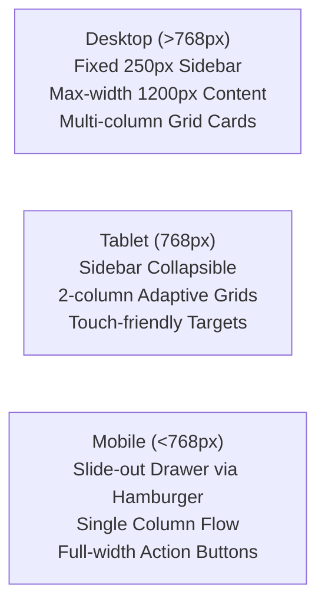

# UX REVIEW
**Design System, Information Architecture, Cognitive Usability, and Accessibility Audit**  
*SAT Intelligent Learning System — Frontend Design Subsystem*  
*Report Date: September 22, 2026*

---

## 1. DESIGN PHILOSOPHY: MODERN ACADEMIC CALM

The interface was designed specifically for **Vietnamese high school students (ages 15–18)** preparing for high-stakes international university admissions. These learners require an environment that fosters sustained concentration, intellectual seriousness, and emotional calm.



### Key Aesthetic Principles
* **Serious, Not Childish**: Eliminates condescending gamification elements (e.g., cartoon animals, flashing coin animations, artificial "streak freezes") that induce shallow dopamine cycles without building academic grit.
* **Cognitive Load Minimization**: Visual clutter is strictly suppressed. Questions, reading passages, and mathematical formulas are presented on high-contrast, uncluttered white surfaces (`--color-surface: #ffffff`) against a soft warm-gray background (`--color-bg: #fafaf9`).
* **Instantaneous Responsiveness**: Zero external stylesheet or webfont dependencies ensure instant render times, avoiding Layout Shift (CLS) on low-bandwidth school Wi-Fi or mobile cellular data.

---

## 2. INFORMATION ARCHITECTURE & NAVIGATION

The platform organizes user interaction across **8 dedicated primary sections**, accessible via a persistent sidebar navigation menu:



### Section Breakdown & Functional Scope

| Section ID | English Label | Vietnamese Label | Functional Scope & Interactivity |
| :--- | :--- | :--- | :--- |
| `#today` | TODAY | HÔM NAY | Personalized daily greeting, automated recommendation engine, quick session launchers (20/45/90 min), due flashcard counter. |
| `#learn` | LEARN | HỌC | Curriculum library: Track A (Digital SAT strategy) and Track B (Academic English), containing step-by-step RW and Math thinking frameworks. |
| `#practice` | PRACTICE | LUYỆN TẬP | Targeted drills filterable by 8 domains and 5 difficulty levels; immediate answer checking with distractor trap diagnostics. |
| `#flashcards`| FLASHCARDS | THẺ GHI NHỚ | Interactive 3D flip-card interface with 4-button SRS scheduling (`Again`, `Hard`, `Good`, `Easy`). |
| `#timed` | TIMED | LUYỆN THỜI GIAN | Simulated clock countdown enforcing official per-question pacing (RW: ~71s/item; Math: ~95s/item). |
| `#mock` | MOCK SAT | THI THỬ | Full-scale 2-section, 4-module test simulation with running timer and module review flags. |
| `#mistakes` | MY MISTAKES | LỖI CỦA TÔI | Error tracking notebook grouping past mistakes by the 17 cognitive error types, facilitating targeted re-drills. |
| `#progress` | PROGRESS | TIẾN ĐỘ | Visual skill map displaying mastery tiers (`STRONG`, `DEVELOPING`, `WEAK`) across all 15 Digital SAT skills. |

---

## 3. COLOR PALETTE & TYPOGRAPHY SPECIFICATIONS

### 3.1 Color Palette
The color system utilizes an intentional academic scheme based on deep navy, neutral slates, crisp whites, and semantic signal accents:

| Token Name | Hex Code | Visual Swatch | Semantic Purpose |
| :--- | :---: | :---: | :--- |
| `--color-text` | `#1a1a2e` | Deep Academic Navy | Primary typography, headers, high-contrast readability |
| `--color-bg` | `#fafaf9` | Warm Off-White / Alabaster | Page background, reduces eye strain during long sessions |
| `--color-surface` | `#ffffff` | Pure White | Elevated cards, question containers, modals |
| `--color-border` | `#e5e7eb` | Subtle Gray | Structural dividing lines, card borders |
| `--color-primary` | `#3b82f6` | Classical Royal Blue | Active buttons, navigational highlights, interactive states |
| `--color-primary-hover`| `#2563eb` | Deep Blue | Hover and focus states |
| `--color-success` | `#22c55e` | Calm Emerald Green | Correct answer indicator, high mastery progress bar ($\ge 80\%$) |
| `--color-warning` | `#f59e0b` | Warm Amber | Moderate mastery progress ($50-79\%$), 'Hard' SRS rating |
| `--color-error` | `#ef4444` | Crimson Rose | Incorrect answer feedback, error tag, 'Again' SRS reset |
| `--color-muted` | `#6b7280` | Muted Charcoal | Secondary labels, timestamps, explanatory notes |

### 3.2 System Font Stack
To guarantee zero latency and eliminate external webfont network waterfalls, the UI relies exclusively on native system typography:
```css
font-family: system-ui, -apple-system, BlinkMacSystemFont, 'Segoe UI', Roboto, Helvetica, Arial, sans-serif;
```
* **Performance**: 0ms font download delay; zero layout shift (FOUT/FOIT).
* **Cross-Platform Legibility**: Native rendering on Windows (`Segoe UI`), macOS/iOS (`San Francisco`), Android (`Roboto`), and Linux.
* **Monospace Integration**: Code, mathematical expressions, and timers leverage native monospace fonts (`ui-monospace, SFMono-Regular, Consolas`).

---

## 4. RESPONSIVE DESIGN & MULTI-DEVICE SUPPORT

The interface is completely responsive, adapting across three major viewport tiers:



1. **Desktop Viewport ($\ge 1024\text{px}$)**:
   * Fixed 250px left sidebar navigation with vertical action links.
   * Central content container constrained to `max-width: 1200px` to maintain optimal typographic line lengths (60–80 characters per line) for reading comprehension.
   * Multi-column card grids (`grid-2` and `grid-3`) for dashboards and progress stats.
2. **Tablet Viewport ($768\text{px} - 1023\text{px}$)**:
   * Flexible sidebar width; grids collapse to 2 columns.
   * Card paddings adapt to touch-screen ergonomics.
3. **Mobile Viewport ($< 768\text{px}$)**:
   * Fixed hamburger trigger button (`.mobile-menu-btn`) at top-left.
   * Sidebar shifts off-screen (`left: -260px`) and slides in smoothly on toggle (`.sidebar.open`).
   * Main content stacks in a single clean column with padded touch targets ($\ge 44\text{px}\times 44\text{px}$).

---

## 5. INTERACTION DESIGN & SPECIALIZED COMPONENTS

### 5.1 3D Flashcard Flip Animation & SRS Controls
* **3D Transform**: The flashcard component utilizes CSS `perspective: 1000px` with `transform-style: preserve-3d` and `transition: transform 0.6s`.
* **State Flipping**: Toggling `.is-flipped` executes a clean $180^\circ$ Y-axis rotation, revealing the card's reverse side.
* **Discrete Feedback**: The back face embeds 4 distinct SRS confidence controls (`Again`, `Hard`, `Good`, `Easy`) directly wired to the FSRS-lite interval scheduling algorithm.

### 5.2 Bilingual Support Matrix (Linguistic Scaffolding)
To support Vietnamese students at varying English proficiencies, the system includes a global language toggle accommodating 3 distinct tiers:
* **Foundation**: Vietnamese translations displayed beneath all English directions, framework steps, and error explanations.
* **Intermediate**: English first, with expandable Vietnamese glosses and hints.
* **Advanced**: 100% English immersion, mirroring the actual testing environment of the College Board.

### 5.3 Privacy & Zero-Server Data Persistence
* **Complete Student Privacy**: All diagnostic results, error histories, flashcard intervals, and profile settings are stored locally in the browser via `window.localStorage` (`sat_system` key).
* **Zero External Telemetry**: No tracking cookies, no third-party analytics scripts, and no external user database. The application functions completely offline once loaded.

### 5.4 Keyboard Accessibility
* Form inputs, navigation links, and answer buttons support full keyboard tab navigation (`Tab`, `Shift+Tab`).
* Practice answer choices can be triggered via keyboard shortcuts (`A`, `B`, `C`, `D`), and flashcards flip via `Spacebar` / `Enter`.
