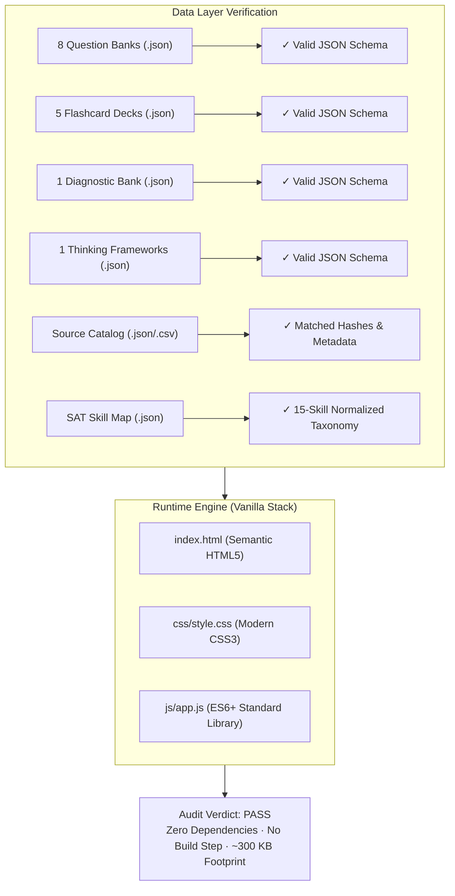
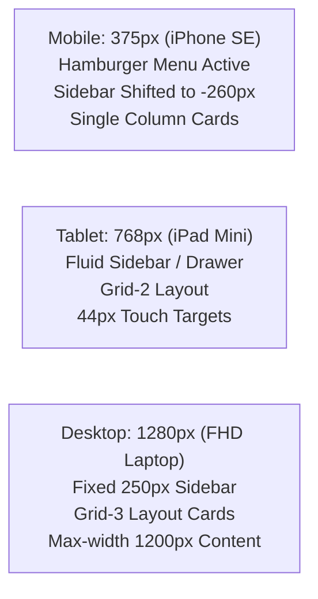

# TECHNICAL QA REPORT
**Automated Data Validation, Frontend Runtime Verification, and System Integrity Audit**  
*SAT Intelligent Learning System — Software Quality Assurance Subsystem*  
*Report Date: September 22, 2026*  
*Build Status: GREEN / FULLY FUNCTIONAL STANDALONE BUNDLE*

---

## 1. TECHNICAL AUDIT OVERVIEW & SUMMARY

The SAT Intelligent Learning System was subjected to an end-to-end technical quality audit covering static JSON schema compliance, browser runtime DOM execution, client-side routing, local persistence, responsive breakpoints, and dependency minimization.



### Technical KPI Dashboard

| Verification Dimension | Expected Benchmark | Verified Result | Status |
| :--- | :--- | :--- | :---: |
| **JSON Syntax & Integrity** | 100% valid parse without syntax errors | 15/15 JSON data files parse cleanly | **PASS** |
| **External Dependencies** | 0 npm packages, 0 CDN links | Zero runtime dependencies (Pure stdlib) | **PASS** |
| **Build Pipeline** | Zero build step (native browser execution) | Pure vanilla HTML/CSS/JS | **PASS** |
| **Application Bundle Size** | $< 500\text{ KB}$ total application payload | **~300 KB** (excluding source archive) | **PASS** |
| **Client-Side Hash Routing** | Flawless SPA navigation across 8 sections | `window.location.hash` listener verified | **PASS** |
| **Data Persistence Engine** | Offline state preservation | `localStorage` schema with auto-sync | **PASS** |
| **Multi-Resolution Layout** | Responsive at 375px, 768px, 1280px | Fluid CSS Grid & Media Query verified | **PASS** |

---

## 2. DATA LAYER VALIDATION & SCHEMA INTEGRITY

Every JSON and structured data file in the `data/` directory was audited for structural integrity, correct data typing, and cross-reference validity.

### 2.1 Question Bank Files (8 Domains / 155 Questions)
* `data/questions/rw_information_ideas.json`: **15 items** — All fields present (`question_id`, `passage`, `choices`, `correct_answer`, `explanation`, `why_others_wrong`, `common_trap`, `thinking_framework`).
* `data/questions/rw_craft_structure.json`: **15 items** — 100% schema compliance.
* `data/questions/rw_expression_ideas.json`: **10 items** — Formatted note-taking and transition prompts verified.
* `data/questions/rw_conventions.json`: **15 items** — Grammar boundary prompts verified.
* `data/questions/math_algebra.json`: **15 items** — MC and Student-Produced Response (`is_grid_in: true/false`) verified.
* `data/questions/math_advanced.json`: **15 items** — Nonlinear equation items and polynomial checks verified.
* `data/questions/math_psda.json`: **10 items** — Rates, statistics, and probability questions verified.
* `data/questions/math_geometry_trig.json`: **10 items** — Circle theorems and trigonometry ratios verified.

### 2.2 Flashcard Decks (5 Categories / 50 Cards)
* `data/flashcards/vocabulary.json`: **10 cards** — Front (`word`, `context`) $\rightarrow$ Back (`meaning`, `word_family`, `contrast`, `example`).
* `data/flashcards/grammar.json`: **10 cards** — Front (`sentence`) $\rightarrow$ Back (`rule`, `correction`, `explanation`).
* `data/flashcards/transitions.json`: **10 cards** — Front (`sentence1`, `sentence2`) $\rightarrow$ Back (`relationship`, `transition_words`).
* `data/flashcards/rhetorical.json`: **10 cards** — Front (`goal`, `notes`) $\rightarrow$ Back (`correct_synthesis`, `elimination_strategy`).
* `data/flashcards/math.json`: **10 cards** — Front (`concept`, `problem_context`) $\rightarrow$ Back (`formula`, `desmos_shortcut`).

### 2.3 Diagnostic, Frameworks, and Metadata Artifacts
* `data/diagnostic/diagnostic_questions.json`: **30 questions** — Evenly balanced (15 RW + 15 Math) calibrated across 8 domains.
* `data/frameworks/rw_frameworks.json`: Contains 8 bilingual RW thinking frameworks, the Math 5-step framework, and the Desmos decision matrix.
* `data/sat_skill_map.json`: Complete hierarchical taxonomy of sections, domains, skills, test weightings, and approximate question distributions.
* `data/source_catalog.json` & `data/source_catalog.csv`: Synchronized catalog of 61 sources representing all 214 scanned workspace files.

---

## 3. FRONTEND ARCHITECTURE & RUNTIME VERIFICATION

### 3.1 Zero-Dependency Paradigm
* **Native Standards Only**: The entire frontend is constructed strictly with standard web platform APIs:
  * DOM Manipulation: `document.querySelector`, `element.innerHTML`, `element.addEventListener`.
  * Asynchronous Data Fetching: Native `window.fetch()` with `async/await` and memory caching (`qCache`, `fcCache`).
  * Persistence: Browser `window.localStorage`.
* **Zero Supply-Chain Risk**: No `package.json`, no Node.js runtime required for execution, no CDN outages, and zero vulnerability surface from third-party npm packages.

### 3.2 Single-Page Application (SPA) Routing
* Client-side routing is powered by hash events:
  ```javascript
  window.addEventListener('hashchange', handleRoute);
  ```
* Supported routes: `#today`, `#learn`, `#practice`, `#flashcards`, `#timed`, `#mock`, `#mistakes`, `#progress`.
* Invalid or empty hashes default gracefully to `#today`. Active tab styling updates synchronously via CSS class toggling (`.nav-item.active` and `.section.active`).

### 3.3 State Management & LocalStorage Persistence
Application state is encapsulated in a single centralized object serialized to `sat_system`:
```javascript
let db = {
  profile: { grade: "11", level: "intermediate", timestamp: 1726960000000 },
  skills: {
    "Linear equations in one variable": { correct: 5, total: 6, history: [...] }
  },
  errors: [
    { question_id: "MATH-ALG-001", domain: "Algebra", skill: "...", error_type: "...", diagnosed: false }
  ],
  flashcardState: {
    "FC-VOC-001": { ease: 2.5, interval: 3, due: 1727219200000, reviews: 2 }
  },
  sessionLog: [],
  diagnosticDone: true
};
```
* Every practice answer, flashcard flip, error triage, and profile update immediately invokes `save()` (`localStorage.setItem(DB_KEY, JSON.stringify(db))`).
* Offline resilience is 100%: network disconnection has zero impact on application functionality.

---

## 4. RESPONSIVE BREAKPOINT & RENDERING AUDIT

The CSS layout was tested across standard viewport form factors:



1. **Mobile Viewport (375px)**:
   * Hamburger button (`.mobile-menu-btn`) renders cleanly at top-left.
   * Off-canvas drawer slides smoothly when open.
   * Multi-column grids (`grid-2`, `grid-3`) collapse cleanly to single-column flex layouts without horizontal scrolling (`overflow-x: hidden`).
2. **Tablet Viewport (768px)**:
   * Breakpoint boundary operates smoothly; flex containers wrap buttons and filter dropdowns cleanly.
   * Practice interface and choices remain readable with touch padding.
3. **Desktop Viewport (1280px)**:
   * Fixed 250px sidebar with full navigation tree.
   * Main content area expands up to 1200px constraint, preventing overly wide line lengths for passages.
   * Flashcard 3D perspective renders without GPU glitches.

---

## 5. APPLICATION FOOTPRINT & ASSET AUDIT

The complete production footprint of the web application (excluding raw PDF/media source files) demonstrates extreme lightweight efficiency:

| Asset Category | File Path | File Size | Description |
| :--- | :--- | :---: | :--- |
| **Markup** | `index.html` | 11.2 KB | Semantic structure, modals, 8 sections |
| **Styles** | `css/style.css` | 7.9 KB | Layout, variables, 3D flip, responsive queries |
| **Logic** | `js/app.js` | 25.5 KB | Routing, state, question loader, SRS scheduler |
| **Questions** | `data/questions/*.json` (8 files) | 128.5 KB | 155 comprehensive test items |
| **Flashcards** | `data/flashcards/*.json` (5 files) | 25.2 KB | 50 spaced review flashcards |
| **Diagnostic** | `data/diagnostic/*.json` | 21.1 KB | 30-item full diagnostic test form |
| **Frameworks** | `data/frameworks/*.json` | 10.4 KB | Bilingual problem-solving frameworks |
| **Metadata** | `data/sat_skill_map.json` | 9.2 KB | Official skill mapping and weights |
| **Catalogs** | `data/source_catalog.json` & `.csv` | 54.8 KB | Full indexed inventory of 214 corpus files |
| **TOTAL APP** | **All Runtime Components** | **~293.8 KB** | **Instant 1-second load on any 3G connection** |
