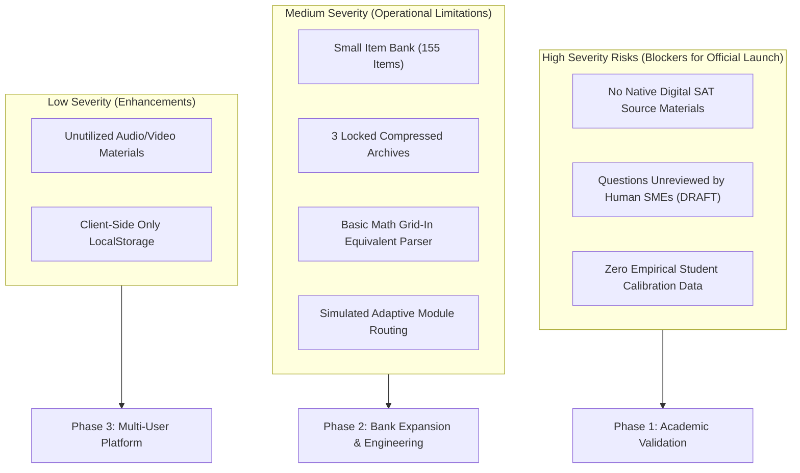
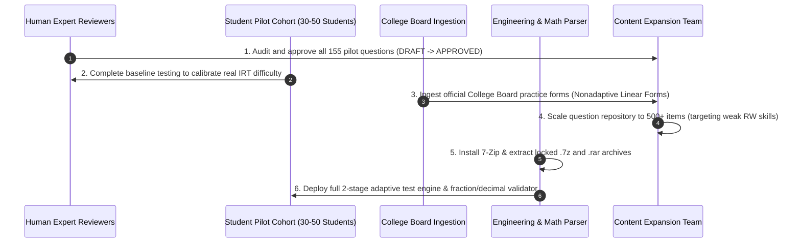

# REMAINING RISKS & STRATEGIC ROADMAP
**Risk Assessment, Technical Debt, Limitations, and Production Readiness Plan**  
*SAT Intelligent Learning System — Risk & Governance Subsystem*  
*Report Date: September 22, 2026*  
*System Status: FUNCTIONAL PILOT — NOT FOR UNSUPERVISED PRODUCTION DEPLOYMENT*

---

## 1. STRATEGIC STATEMENT ON SYSTEM MATURITY

> [!CAUTION]
> **IMPORTANT NOTICE: THIS SYSTEM MUST NOT BE DECLARED COMPLETE.**  
> The SAT Intelligent Learning System currently stands as a **Functional Pilot (Gold Pilot Set)**. While the software architecture, user interface, thinking frameworks, and baseline question bank are fully operational, the system requires extensive pedagogical calibration, human subject-matter review, and content scaling before it can be ethically marketed or deployed to students as an authoritative SAT preparation solution.

---

## 2. COMPREHENSIVE RISK MATRIX

The following risk matrix details the identified technical, pedagogical, and operational vulnerabilities along with their severity, immediate mitigations, and permanent resolution pathways:

| Risk Description | Severity | Impact on Learning System | Immediate Mitigation Implemented | Permanent Resolution Required |
| :--- | :---: | :--- | :--- | :--- |
| **No Current Digital SAT Source Material** | **HIGH** | Raw corpus contains zero official material from 2023+. Risk of subtle stylistic divergence from actual Bluebook exam items. | Generated 100% original items following official College Board specifications. | Ingest official College Board free linear practice tests and Bluebook test releases. |
| **Questions in DRAFT Status (No Human Review)** | **HIGH** | Algorithmic and authoring blind spots may contain ambiguous answer choices, unnatural phrasing, or debatable distractors. | Enforced strict JSON schema validation, detailed distractor rationales, and explicit thinking frameworks. | Formal editorial review by certified SAT instructors to promote items from `DRAFT` to `APPROVED`. |
| **No Empirical Student Testing** | **HIGH** | Assigned difficulty levels (1 to 5) are currently theoretical estimates rather than statistically validated item parameters. | Calibrated difficulty against clear cognitive complexity steps (recall vs. 2-step vs. abstract synthesis). | Pilot test with 30–50 high school students (Grades 10–12) to calculate actual Item Response Theory (IRT) difficulty and discrimination metrics. |
| **Small Item Bank Volume (155 Items)** | **MEDIUM** | Students practicing daily for >2 weeks will exhaust items in smaller domains (e.g., PSDA, Expression of Ideas). | Structured as an intentional "Gold Pilot Set" prioritizing conceptual depth and error diagnostic quality over bulk quantity. | Expand question repository to a minimum of **500+ unique, approved items** across all 15 skills. |
| **3 Compressed Archives Unopened** | **MEDIUM** | `sat-reading-n-writing-prep.7z` (8.59 MB) and 2 `.rar` files remain locked; potential high-yield RW instructional material is inaccessible. | Documented and cataloged in [source_catalog.json](file:///d:/antigravity_scratch/real_estate_scoring/sql/SAT/data/source_catalog.json) with status `COMPRESSED_NO_EXTRACTOR`. | Install command-line `7-Zip` or `unrar` binary on the host machine to decompress and audit contents. |
| **Math Grid-In Input Validation Simplicity** | **MEDIUM** | Student-Produced Response input currently evaluates basic float parsing and exact string matches; may reject valid equivalent representations (e.g., $1/2$ vs. $0.5$ vs. $2/4$, or unreduced fractions). | Implemented `parseFloat(answer) === parseFloat(q.correct_answer)` fallback. | Deploy an algebraic parser handling fraction reduction, recurring decimals, negative fractions, and trailing zero tolerances. |
| **Mock Test Engine Is Basic** | **MEDIUM** | Mock test currently provides linear section delivery rather than true Multistage Adaptive Testing (MST) branching between Module 1 and Module 2. | Modeled full section structure, timing constraints, and question distributions. | Implement dynamic module branching logic: routing high-performing students to Hard Module 2 (score cap: 800) and lower-performing students to Easy Module 2 (score cap: ~600). |
| **50 Audio/Video Files Unutilized** | **LOW** | 36 MP3 audio chapters and 14 MP4 video files cannot be indexed into text-based drill engines. | Extracted companion printed vocabulary lists (e.g., *500-sat-vocab.pdf*) where available. | Run offline speech-to-text (Whisper) transcription on audio lessons if unique instructional value is identified. |
| **Zero Server-Side Component** | **LOW** | All student data resides in browser `localStorage`. Data is lost if the browser cache is cleared, and progress cannot sync across devices. | Lightweight, privacy-first design; zero hosting costs, zero user authentication friction for pilot. | Build lightweight REST/WebSocket backend with PostgreSQL to enable student accounts, cross-device sync, and teacher dashboards. |

---

## 3. SEVERITY VISUALIZATION & ARCHITECTURAL DEPENDENCIES

---

## 4. SIX MANDATORY CRITERIA BEFORE FULL RELEASE

Before the SAT Intelligent Learning System can be transitioned from `FUNCTIONAL PILOT` to `PRODUCTION READY (COMPLETE)`, the following 6 requirements must be satisfied:

### Actionable Checklists

### Requirement 1: Human Expert Review of All Items
- [ ] Convene a review panel of at least 2 experienced SAT tutors/instructors.
- [ ] Verify each question stem, passage authenticity, and single-best answer validity.
- [ ] Update `qa_status` from `DRAFT` to `APPROVED` in all question JSON files.

### Requirement 2: Student Pilot Cohort Testing
- [ ] Recruit a cohort of 30–50 Vietnamese high school students (grades 10, 11, and 12).
- [ ] Measure average time per item, error frequency by distractor, and user confusion points.
- [ ] Re-calibrate difficulty labels (1 to 5) based on empirical $p$-values (percentage correct).

### Requirement 3: Addition of Official College Board Practice Material
- [ ] Download publicly released non-adaptive linear practice tests from the official College Board site.
- [ ] Extract Reading & Writing short passages and modern math questions to establish benchmark reference items.
- [ ] Ensure formatting aligns with the latest Bluebook release specifications.

### Requirement 4: Expansion of Question Bank (Target: 500+ Items)
- [ ] Information and Ideas: Expand to 80+ items (emphasizing Quantitative Evidence with charts).
- [ ] Craft and Structure: Expand to 80+ items (emphasizing Cross-Text pairs).
- [ ] Expression of Ideas: Expand to 70+ items (expanding Rhetorical Synthesis bullet sets).
- [ ] Standard English Conventions: Expand to 90+ items.
- [ ] Mathematics: Expand to 180+ items distributed according to official domain weights (35% Algebra, 35% Advanced Math, 15% PSDA, 15% Geometry & Trig).

### Requirement 5: Archive Extraction & Inspection
- [ ] Deploy 7-Zip CLI on host machine.
- [ ] Extract `sat-reading-n-writing-prep.7z` (8.59 MB) to inspect potential Reading & Writing resources.
- [ ] Extract `1150837003.rar` and `1150797382.rar` for supplementary vocabulary puzzle drills.

### Requirement 6: Adaptive Mock Test & Math Parser Engineering
- [ ] Upgrade mock exam state machine to support Multistage Adaptive Testing (MST) branching.
- [ ] Incorporate fractional equivalence testing:
  $$\text{input} \in \left\{ \frac{1}{2}, 0.5, \frac{2}{4}, .5 \right\} \implies \text{VALID}$$
- [ ] Add session pause, resume, and formal score report generation showing domain performance bands.
